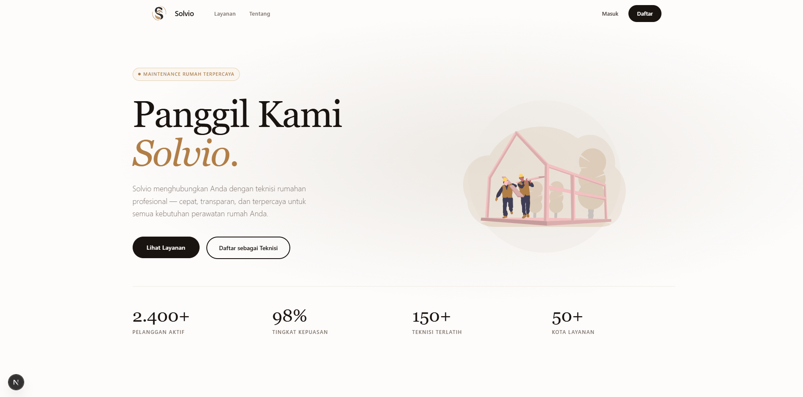
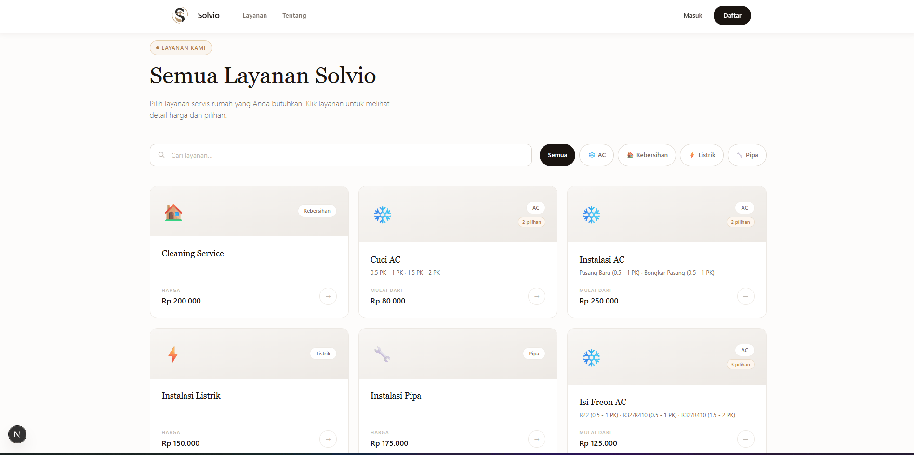
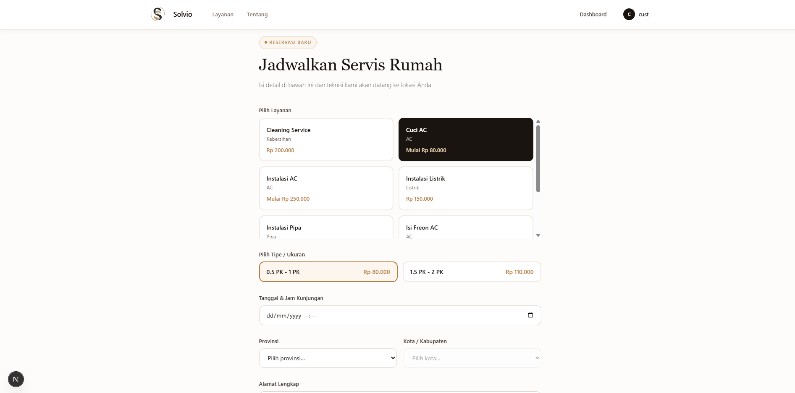
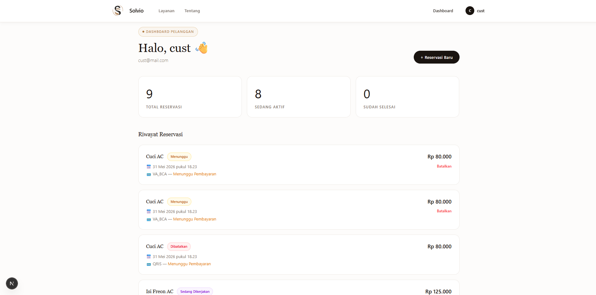
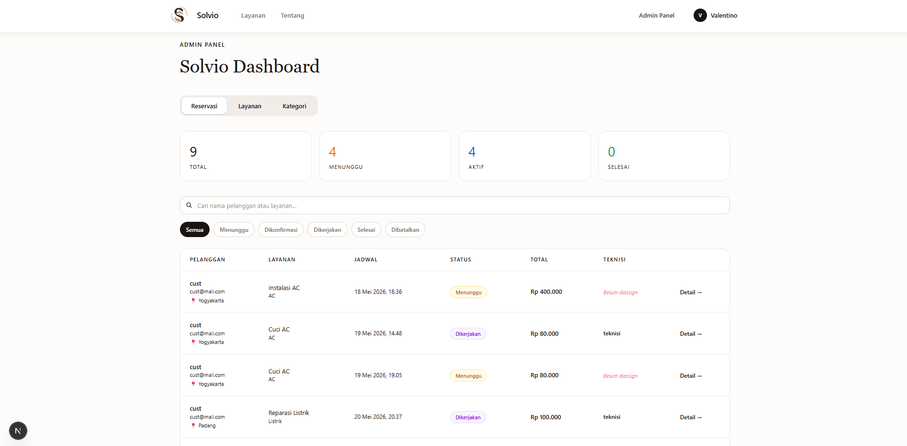
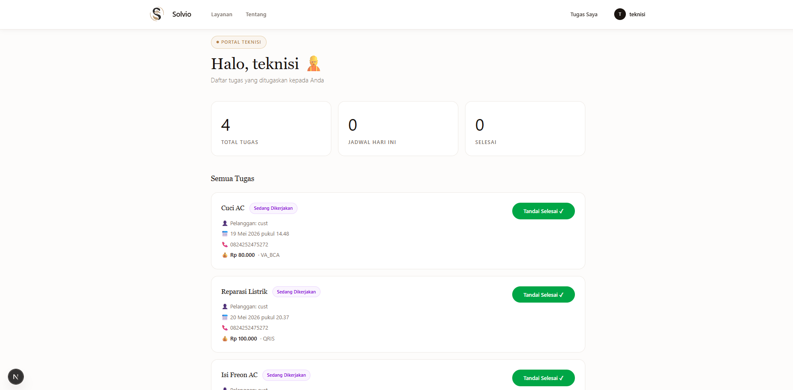
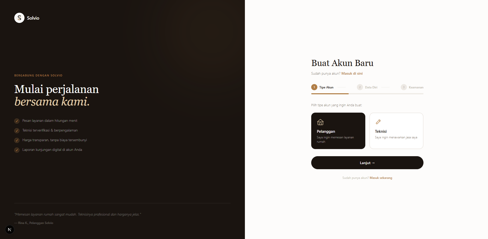

# Solvio — Frontend

Solvio is a home service booking platform that connects customers with professional technicians quickly, easily, and transparently.

🌐 **Live Demo:** [https://crack-fe-valentinojuan79.vercel.app](https://crack-fe-valentinojuan79.vercel.app)  
🔗 **Backend Repository:** [https://github.com/valentinojuan79/crack-be-valentinojuan79](https://github.com/valentinojuan79/crack-be-valentinojuan79)

---

## 📋 Features

### 👤 Customer
- Register & Login with JWT authentication
- Browse & search services by name and category
- Book a service with variant selection, schedule, and address
- Payment via Midtrans Snap (QRIS, VA BCA/BNI/BRI/Mandiri, GoPay, Cash)
- Real-time booking status tracking (Pending → Confirmed → In Progress → Completed)
- Cancel bookings that are still pending or confirmed
- View full booking history on the dashboard
- Submit review & rating for technicians after service is completed

### 🛠️ Admin
- Admin dashboard with booking statistics
- Manage all bookings with filter and search
- Confirm bookings and assign technicians
- Update booking status
- Full CRUD management for services & categories

### 🔧 Technician
- Dashboard for assigned tasks
- Update task progress (On Progress → Completed)
- Upload proof of work
- Confirm cash payment from customer

---

## 🧰 Tech Stack

| Technology | Description |
|---|---|
| [Next.js](https://nextjs.org) | React framework with App Router |
| [TypeScript](https://www.typescriptlang.org) | Static typing |
| [Tailwind CSS](https://tailwindcss.com) | Utility-first CSS framework |
| [Midtrans Snap](https://midtrans.com) | Payment gateway integration |

---

## 🚀 Installation & Running Locally

### Prerequisites
- Node.js v18+
- npm or yarn

### Steps

```bash
# 1. Clone the repository
git clone https://github.com/valentinojuan79/crack-fe-valentinojuan79.git
cd crack-fe-valentinojuan79

# 2. Install dependencies
npm install

# 3. Set up environment variables
cp .env.local.example .env.local
```

Edit `.env.local` and fill in the values:

```env
NEXT_PUBLIC_API_URL=http://localhost:3000
NEXT_PUBLIC_MIDTRANS_CLIENT_KEY=Mid-client-xxxxxx
```

```bash
# 4. Start the development server
npm run dev
```

Open [http://localhost:3000](http://localhost:3000) in your browser.

---

## 🌍 Deployment

Frontend is deployed to **Vercel** with the following configuration:

| Setting | Value |
|---|---|
| Framework | Next.js |
| Build Command | `npm run build` |
| Output Directory | `.next` |

Environment variables set in Vercel:
```
NEXT_PUBLIC_API_URL=https://crack-be-valentinojuan79.onrender.com
NEXT_PUBLIC_MIDTRANS_CLIENT_KEY=Mid-client-xxxxxx
```

---

## 📁 Folder Structure

```
src/
├── app/
│   ├── page.tsx              # Landing page
│   ├── layout.tsx            # Root layout
│   ├── about/                # About page
│   ├── admin/                # Admin dashboard
│   ├── bookings/             # Booking form & detail
│   ├── dashboard/            # Customer dashboard
│   ├── login/                # Login page
│   ├── profile/              # Edit profile
│   ├── register/             # Register page
│   ├── services/             # Browse services
│   └── technician/           # Technician dashboard
├── components/
│   ├── Navbar.tsx            # Main navigation
│   ├── Footer.tsx            # Footer
│   └── ui/                   # Reusable UI components
└── lib/
    ├── api.ts                # HTTP client
    └── auth-context.tsx      # Auth state management
```

---

## 📸 Screenshots

### Landing Page


### Browse Services


### Booking Form


### Customer Dashboard


### Admin Panel


### Technician Dashboard


### Register Page


---

## 👨‍💻 Developer

**Valentino Juan** — [GitHub](https://github.com/valentinojuan79)
